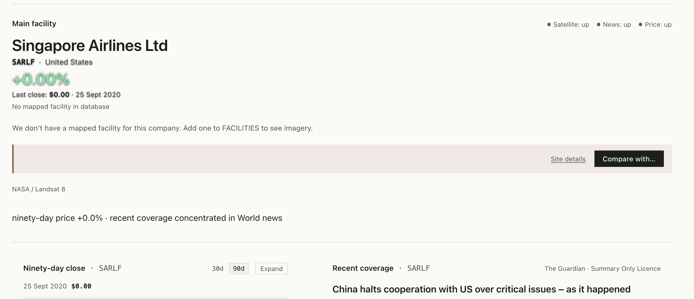
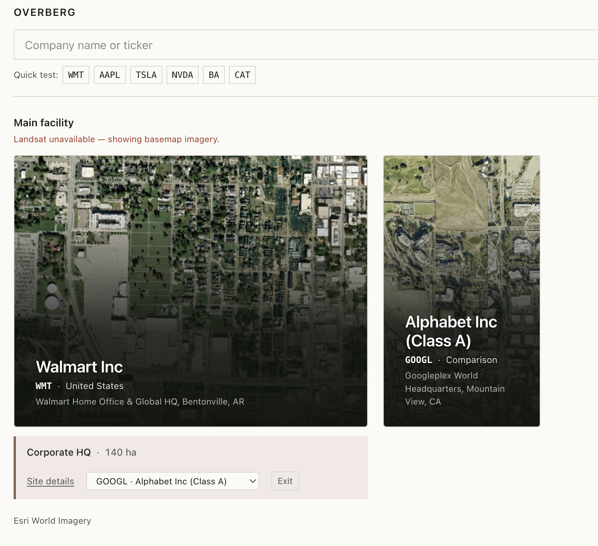
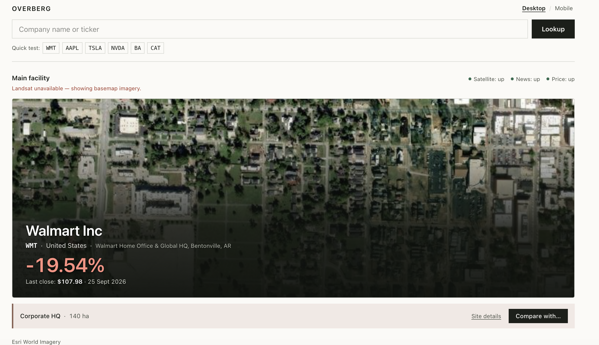
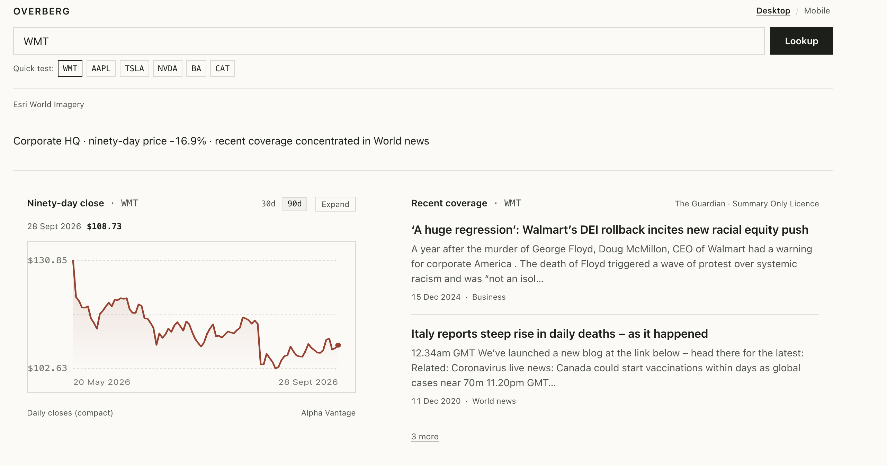
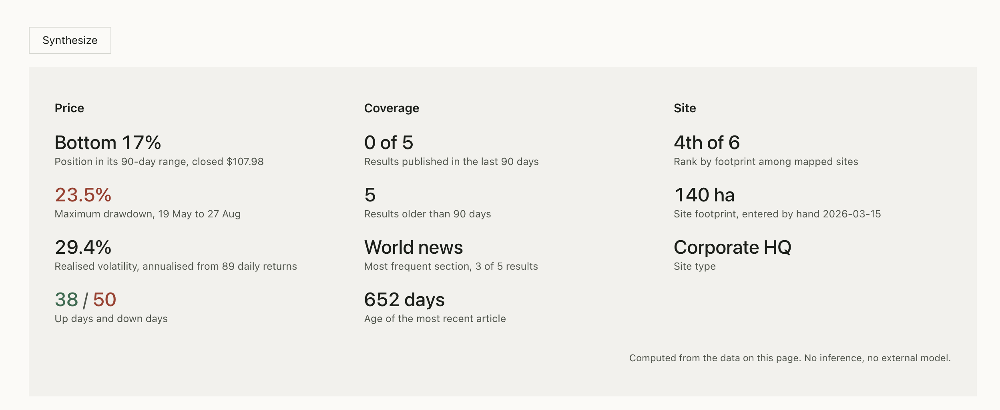
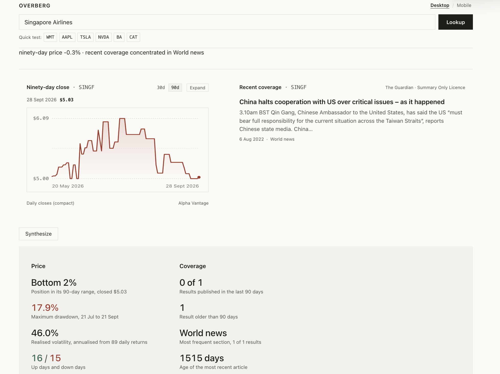
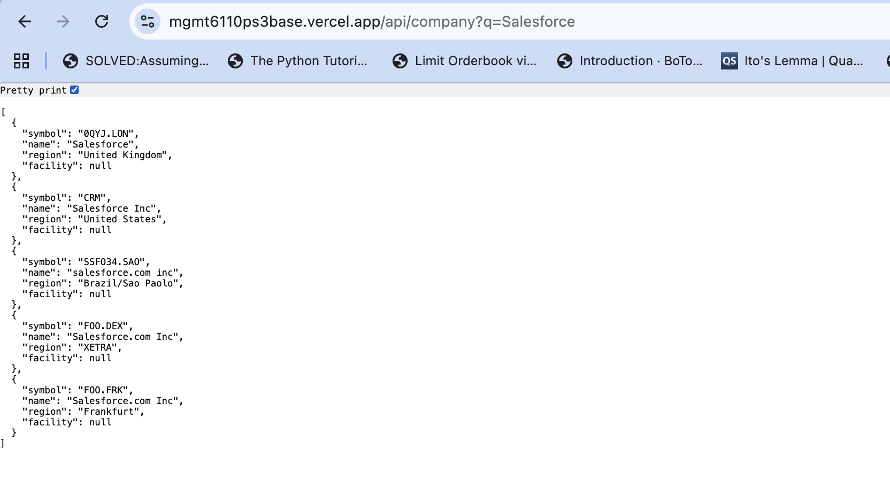

# adversarial_collaboration.md
**Student:** Keziah Sherlyn Vanessa Vickraman · **Group Number**: 2 ·**Problem Set 4 Part 3**

predictions.md committed at `26 Sep 2026` ; first comment for this set on my
board at `26 Sep 26 16:00`

---
## The four-way table

### Four way table based on on group mates' comments 
| Row | What goes in it | What to do with it |
|---|---|---|
| **1 · Found by both** | **Search bar doesn't say what it accepts.** **1 of 3 groupmates.** My F1 (2; H6 + H5) · Teammate YM, F2 (2; H1). Mine is about format (ticker vs name); theirs is about scope (US only vs worldwide). | Raised by 1 groupmate, so at least some new users meet it. Move on, but retest the search: Teammate YM found it already accepts names like "FedEx" and suggests matches, so part of my F1 repair already exists. |
| **2 · Found by them, missed by me** | **a. Unlabelled "-19.54%" hero figure**: could be read as today's move, not the 90-day change. **1 of 3.** Teammate ZL, F2 (3; H1). **b. Same company as separate listings** (Salesforce US / London) with different news and no explanation. **1 of 3.** Teammate ZL, F3 (3; H4). **c. "Compare with…" only compares footprint; price and news missing, layout breaks.** **2 of 3.** Teammate ZL, F4 (2; H2) · Teammate ZM, F2 (3; H4). **d. Switching 30d / 90d doesn't change Synthesize results.** **1 of 3.** Teammate YM, F1 (3; H1). **e. Missing data shown as blanks or "0% volatility"** instead of "no data." **1 of 3.** Teammate YM, F3 (4; H4). **f. "Price: up" shown while Alpha Vantage isn't answering**; "up" also reads as "price went up." **1 of 3.** Teammate YM, F4 (3; H1). This was in my first draft of F5 but removed. **g. No-facility message says "Add one to FACILITIES"** with no way to do it. **1 of 3.** Teammate ZM, F3 (3; H9). | Before deciding anything, repeat each on the live address: a. Look up WMT and check whether the % is labelled. b. Search "Salesforce" and open both listings. c. Tesla → Compare with… → Apple. The only row 2 problem raised by 2 groupmates, so test it first. d. Tesla → 30d → Synthesize, then 90d → Synthesize. e. Look up Capital Trust and Singapore Airlines, then Synthesize. f. Compare /api/health with the status row at the same moment. g. Look up a ticker with no mapped facility. |
| **3 · Found by me, not by them** | **F4 No help or documentation for the news panel** (2; H10). **0 of 3.** Teammate ZM's H10 finding was about Synthesize, not news. **F6 Inconsistent dates and spelling** (1; H4). **0 of 3.** **F7 No way to close the stats panel** (2; H3). **0 of 3.** **F9 Satellite image dominates the page** (2; H8). **0 of 3.** Teammate ZM praised the minimalist layout. | Groupmates posted only three to five findings each, so they may have seen these and left them out. F7 and F9 matter most: ask in the thread whether anyone tried to close the stats panel, and whether the image size bothered anyone. F6 is cosmetic; no need to ask. |
| **4 · Found by both, rated differently** | **a. "Recent coverage" shows old or unrelated news.** **1 of 3.** My F3 (3; H1 + H9) · Teammate ZL, F1 (3 or 4; H2). Seen on WMT as well as AAPL, so it isn't a one-off. **b. "Landsat unavailable" contradicts "Satellite: up."** **2 of 3.** My F5 (2; H1) · Teammate ZL, F2 (3; H1) · Teammate ZM, F1 (1; H2). Split both ways around mine. **c. Synthesize is unclear and its numbers aren't explained.** **1 of 3.** My F2 (3; H2) · Teammate ZM, F5 (4; H10). Mine is about the label and purpose; theirs is about undefined metrics. **d. No favourites or saved companies.** **1 of 3.** My F8 (2; H7) · Teammate ZM, F4 (3; H6). | Mine is the lower rating in a, b (vs Teammate 1), c and d. Ask whether I knew something a new user wouldn't: a. Teammate ZL's point that stale news makes users doubt every other number is stronger than my reasoning. b. I knew Esri was intentional; a new user doesn't, so the error looks real. Raised by 2 groupmates, so most users will notice it. c. As the builder, I already knew what each metric meant. d. Teammate ZM framed it around analysts tracking several tickers, who are one of my stated users. |

## Repair order:
### What I chose and chose not to fix as of now (more to come~)
"-" means that I have skipped this Finding for now—because of the <mark>severity and reach</mark>
| Order | Finding | Severity (source) | Reach | What to do |
|---|---|---|---|---|
| **1** | **Missing data shown as blanks or "0% volatility"** (Capital Trust, Singapore Airlines) | 4 (Teammate YM) | One (1 of 3) | **Fix it first.** Severity 4, however many people meet it. |
| **2** | **"Compare with…" only compares footprint; price and news missing, layout breaks** | 3 (Teammate ZM; higher of 2 and 3) | Most (2 of 3) | **Fix next.** Severity 3, met by most. |
| **3** | **"Landsat unavailable" contradicts "Satellite: up"** (my F5) | 2 (arbiter) | Most (2 of 3) | **Fix as time allows**, first in this group because it's the most widely met. |
| **4** | **"Recent coverage" shows old or unrelated news** (my F3) | 3 (arbiter) | One (1 of 3) | Fix as time allows. |
| **5** | **Synthesize is unclear and its numbers aren't explained** (my F2) | 3 (arbiter) | One (1 of 3) | Fix as time allows. |
| **6** | **Switching 30d / 90d doesn't change Synthesize results** | 3 (Teammate YM) | One (1 of 3) | Fix as time allows. |
| **7** | **"Price: up" shown while Alpha Vantage isn't answering** | 3 (Teammate YM) | One (1 of 3) | Fix as time allows. |
| **8** | **Unlabelled "-19.54%" hero figure** | 3 (Teammate ZL) | One (1 of 3) | Fix as time allows. |
| **9** | **Same company as separate listings** (Salesforce US / London) | 3 (Teammate ZL) | One (1 of 3) | Fix as time allows. |
| **10** | **No favourites or saved companies** (my F8) | 2 (arbiter) | One (1 of 3) | Leave unless minutes. |
| — | **Search bar doesn't say what it accepts** (my F1) | 2 (Teammate YM) | One (1 of 3) | Leave unless minutes. |
| — | **No-facility message says "Add one to FACILITIES"** | 3 (Teammate ZM) | One (1 of 3) | Fix as time allows. |
| — | **No help for the news panel** (my F4) | 2 (mine) | One (only me) | Leave unless minutes. |
| — | **No way to close the stats panel** (my F7) | 2 (mine) | One (only me) | Leave unless minutes. |
| — | **Satellite image dominates the page** (my F9) | 2 (mine) | One (only me) | Leave unless minutes. |
| — | **Inconsistent dates and spelling** (my F6) | 1 (mine) | One (only me) | Leave unless minutes. |

### Screenshot evidence (before)

| Repair | What the screenshot shows | Screenshot |
|---|---|---|
| **1** · Missing data shown as blanks or "0% volatility" | SARLF showing "+0.00%", "Last close: $0.00 · 25 Sept 2020" and "Price: up". |  |
| **2** · "Compare with…" only compares footprint, and the layout breaks | WMT compared with GOOGL: the second image is squeezed into a narrow column with no text between them, because GOOGL has no recorded footprint. |  |
| **3** · "Landsat unavailable" contradicts "Satellite: up" | WMT: the red "Landsat unavailable — showing basemap imagery" line beside "Satellite: up", with the image credited to Esri World Imagery. |  |
| **4** · "Recent coverage" shows old or unrelated news | WMT's "Recent coverage": a 2024 DEI story and a 2020 COVID live blog about Italy. |  |
| **5** · Synthesize is unclear and its numbers aren't explained | The "Synthesize" button and its panel of unlabelled stats ("Bottom 17%", "4th of 6"), with the footnote at the bottom. |  |
| **6** · Switching 30d / 90d doesn't change Synthesize results | SINGF: the 30d / 90d toggle and the Synthesize panel, whose Price and Coverage headings don't say what period they cover. |  |
| **7** · "Price: up" shown while Alpha Vantage isn't answering | WMT's status row reading "Satellite: up · News: up · Price: up". |  |
| **8** · Unlabelled "-19.54%" hero figure | WMT's "-19.54%" in large red text with no label, only "Last close: $107.98 · 25 Sept 2026" below it. |  |
| **9** · Same company as separate listings (Salesforce US / London) | `/api/company?q=Salesforce` returning five listings with different name spellings ("Salesforce", "Salesforce Inc", "salesforce.com inc", "Salesforce.com Inc"). |  |
| **10** · No favourites or saved companies | Added a "Recent:" row under the search box showing the last 5 companies I open, newest first, each reopening in one tap without a new search. It replaces the Quick test chips once there's history, and a Clear button brings Quick test back. The automatic WMT on page load isn't counted. Added one sentence to the end of the privacy notice, with nothing else changed: "Your browser also keeps, on your device only, the last five companies you opened and a list of listings found to have no recent price data; press Clear beside Recent to remove the first, or clear this site's data in your browser to remove both." Clear only removes the recent companies; the "no recent price data" memory from repair 1 stays, and is cleared through the browser's site-data setting. No Alpha Vantage requests were used to build or test it.|[Repair 10](https://mgmt6110ps3base-jr656lxi6-keziah-vickraman-mbai.vercel.app/) | |

| **10** · No favourites or saved companies | Added a "Recent:" row under the search box showing the last 5 companies I open, newest first, each reopening in one tap without a new search. It replaces the Quick test chips once there's history, and a Clear button brings Quick test back. The automatic WMT on page load isn't counted. Added one sentence to the end of the privacy notice, with nothing else changed: "Your browser also keeps, on your device only, the last five companies you opened and a list of listings found to have no recent price data; press Clear beside Recent to remove the first, or clear this site's data in your browser to remove both." Clear only removes the recent companies; the "no recent price data" memory from repair 1 stays, and is cleared through the browser's site-data setting. No Alpha Vantage requests were used to build or test it. | [Repair 10](https://mgmt6110ps3base-jr656lxi6-keziah-vickraman-mbai.vercel.app/) |

## My predictions, checked
- Expected finding 1 (Finding 3, Not the latest news): HELD, ZL gave 3 or 4 beside the 3 I expected, because ZL found the same stale, unrelated news on WMT that I found on AAPL, and the arbiter rated it 3.
- Expected finding 2 (Finding 2, Synthesize unclear): HELD, ZM gave 4 beside the 3 I expected, because ZM raised the Synthesize panel from a different angle (its figures aren't explained), and YM found a separate Synthesize problem (30d / 90d has no effect); the arbiter rated it 3.
- Expected finding 3 (Finding 4, No help for the news panel): BROKE, no one raised it beside the 2 I expected, because groupmates reached for explanations of the numbers rather than of the news source.
- The heuristic I named as my product's worst (1, Visibility of System Status): HELD, because it was the heuristic groupmates used most (4 of their 13 findings), mostly for statuses and figures that didn't say what state or period they described.
- The finding that would show my evaluation was wrong (the product's end goal is unclear): NOT RAISED, because what groupmates actually exposed was data that looked correct but wasn't: a $0.00 listing from 2020 shown as current, "0% volatility", an unlabelled "-19.54%", and "Price: up".

## Q1. Where was confirmation bias in my own evaluation?
As the builder, I evaluated how the page looked and trusted what it showed, so I never questioned whether the numbers were true. I also carried beliefs about my own product into the repairs. I believed Esri imagery was an intentional choice, but the code still treats Landsat as the first choice and Esri as the fallback. I proposed repairs that fixed what I already believed was wrong: that missing values were shown as zero, that the news was simply old, and that "unknown" in /api/health meant Alpha Vantage wasn't answering. In each case the coding agent showed the real cause was something else. In the four-way table, every disagreement had my rating equal to or lower than my groupmate's, which suggests I underrated problems I already knew how to work around.

## Q2. Which prediction broke, and what did it teach me?
Two broke: nobody raised my missing-help finding for the news panel, and nobody said the product's end goal was unclear. My predictions assumed users would struggle with purpose and explanation. Instead they struggled with numbers and labels that looked authoritative but were misleading. That taught me my blind spot was data correctness, not purpose: I knew what each number meant and where it came from, so I never read the page the way a newcomer would.

## Q3. Which groupmate finding did I nearly dismiss, and what did the evidence say?
YM's finding that Singapore Airlines showed "0% volatility, annualised from 47 daily returns". When I checked SINGF, it showed 46.0% volatility from 89 returns, so the finding didn't reproduce and I nearly set it aside. The search shows five Singapore Airlines listings, though, and checking SARLF showed something worse than YM described: "+0.00%", "Last close: $0.00" and a "ninety-day" chart from 25 Sept 2020, all presented as current. The finding was right about the problem, but described it on a listing I hadn't tested.

## Q4. What did I revise, which heuristic does it serve, and how do I know it worked?
I made ten repairs. The most important:
- Repair 1 (heuristic 4, Consistency and Standards): listings with no recent trading now show "No recent trading recorded on this listing. Last price on record: …" instead of "+0.00%" and $0.00, and Synthesize names any column it leaves out and why. On the repair 1 deployment, SARLF no longer shows a figure or chart, and AAPL's figures match my before screenshot.
- Repair 4 (heuristic 1, Visibility of System Status): the news search now uses the company's everyday name in headlines, and the panel is headed "Coverage" with a warning when the newest article is over 90 days old. On the repair 4 deployment, WMT shows Walmart headlines instead of the 2020 COVID live blog.
- Repairs 3 and 7 (heuristic 1): the red "Landsat unavailable" line is gone, the Satellite dot follows the page's own imagery request, and all dots say "available", "limited" or "unavailable" instead of "up".
For each repair I compared before and after screenshots from the same views, and ran the checks the coding agent listed on that repair's deployment link, in a private window to avoid cached responses.

## Q5. What did my users give me that I could not have found myself?
They tested companies I never would have: Walmart, Salesforce, Capital Trust and Singapore Airlines, while I kept to AAPL and the Quick test chips, where the data works best. Those companies exposed the name-spelling bug behind the Salesforce listings and Amazon's five-year-old news, the Compare layout breaking when a footprint is missing, and the dead SARLF listing. They also read labels without knowing what I meant by them: "up" beside Price as the stock going up, and "-19.54%" as today's move.

## Q6. Did the AI help me confirm, or help me falsify?
Both, in different roles. The blind arbiter agreed with my severity in all four disagreements, which could mean my ratings were right, or that my rewritten findings still read more favourably than my groupmates' shorter ones; with only four cases, I can't tell which. The sceptical coding agent mostly helped me falsify. In most repairs it showed that my diagnosis was wrong, such as the zeros coming from real $0.00 closes rather than the display, the news query using legal names, /api/health never checking Alpha Vantage, and the Compare layout collapsing when a footprint was missing, and it proposed smaller repairs that fixed the real cause. The AI could also spread an unchecked claim: a groupmate's statement that search "suggests matches as you type" went into my evidence unverified until the coding agent checked the code and found it was false.
